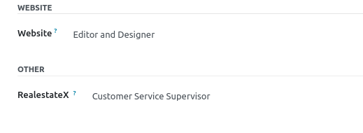
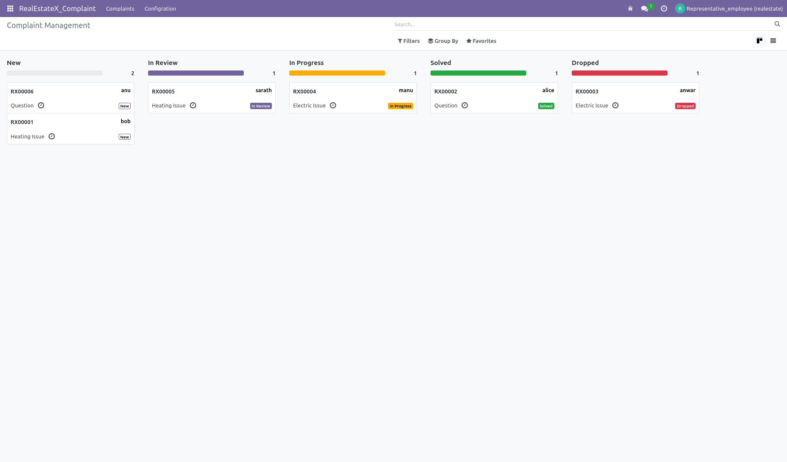
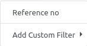

# RealEstateX Compliant Management
odoo custom module for RealEstate complaint management
# Problem Statement /Requirement Work Flow

### How to Run
Setup odoo System and Configure the custom addons(RealEstateX_odoo_addons) in odoo config file
```
addons_path = /opt/odoo16/odoo16/addons,opt/odoo16/odoo16/RealEstateX_odoo_addons
```
Restart Server Enable developer mode  App menu->Update App list->RealEstateX complaint Management System

1. Dependency module Website,mail,l10n_din5008
2. Enable din5008 layout for report from settings


create user/employee and configure user in relative group supervisor/representative realestate



### Complaint Website Form 
Router url: /ask_realestatex/ 
```
http://localhost:8069/ask_realestatex/

```
1. Website have required fields like customer name,email,complaint type,description,address
2. Many2one Field complaint type,state,country

3. Response to customer to success page with reference number after form submit 

4. Send email with confirmation by reference number


### Kanban view (supervisor/representative)

### List view

#### search/filter/groupby




### Pipeline flow
1. when customer submit the form assign to representative complaint in draft state
2. In review for complaints that are being classified by a customer
service representative

3. In Progress: for complaints that are being addressed with an action
plan If the complaint is a question, the customer service representative can just
message the tenant with the answer and close the complaint.
Email button left side

4. Solved: for complaints that have been solved


Auto send email tenant for solved

5. Dropped: for complaints that have been dropped

Auto email send dropped complaint


## Work order
For those complaints that need intervention, the customer service
supervisor should print a work order containing the data of the complaint (customer,
address, date, action plan, etc). This report should follow the DIN5008 standard.


### Tracked/logged Activity


### Vision Furture Development
1. If time allows, I envision implementing an automated system to assign complaint 
representatives based on an algorithm. This algorithm would consider various factors 
such as the number of available representatives and their recent activity. 
Specifically, if there are five or more representatives available, 
the system would assign a representative based on factors such as the 
representative's last update time, prioritizing those who have been more active recently. 
By optimizing the assignment process in this way, we aim to improve efficiency and 
cost-effectiveness while ensuring timely resolution of complaints.
